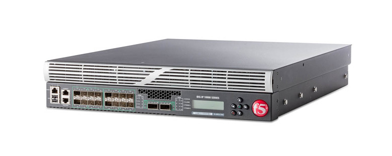

# Проектирование высоконагруженного аналога Альфа-банка

## Описание сервиса

**«Альфа-банк»** — крупнейший частный банк в России, занимающий четвёртое место по размеру активов. В 2025 году количество частных клиентов банка превышает 36 млн человек, количество клиентов малого и среднего бизнеса — 1,9 млн.

## Целевая аудитория

- Количество пользователей в месяц(**MAU**): 36млн [1](https://ru.wikipedia.org/wiki/%D0%90%D0%BB%D1%8C%D1%84%D0%B0-%D0%B1%D0%B0%D0%BD%D0%BA#:~:text=%D0%90%D0%BB%D1%8C%D1%84%D0%B0%2D%D0%B1%D0%B0%D0%BD%D0%BA%20%D0%B2%D1%85%D0%BE%D0%B4%D0%B8%D1%82,13%5D.).
- Количество пользователей в день(**DAU**): ~8-15млн [2](https://ru.wikipedia.org/wiki/%D0%90%D0%BB%D1%8C%D1%84%D0%B0-%D0%B1%D0%B0%D0%BD%D0%BA#:~:text=%D0%90%D0%BB%D1%8C%D1%84%D0%B0%2D%D0%B1%D0%B0%D0%BD%D0%BA%20%D0%B2%D1%85%D0%BE%D0%B4%D0%B8%D1%82,13%5D.).

- Географическое положение: Россия.

DAU была расчитана, как 20-40% пользователей.

## Ключевой функционал сервиса

- Авторизация и аутентификация пользователя

* Просмотр баланса и счетов

* Переводы между счетами и пользователями

* Открытие счетов

* Открытие кредитов

* Отслеживание баланса, проходящих операций в реальном времени

* История транзакций

## Ключевые продуктовые решения

- Все финансовые операции обрабатываются сервером с гарантией консистентности

- История операций хранится на сервере и доступна с любого устройства

- Баланс и последние операции кэшируются для быстрого отображения

- Переводы выполняются синхронно с подтверждением результата

- Реал-тайм обновления баланса

- Push уведомления

# Расчет нагрузки

## Продуктовые метрики

- Количество пользователей в месяц(**MAU**): 36млн [1](https://ru.wikipedia.org/wiki/%D0%90%D0%BB%D1%8C%D1%84%D0%B0-%D0%B1%D0%B0%D0%BD%D0%BA#:~:text=%D0%90%D0%BB%D1%8C%D1%84%D0%B0%2D%D0%B1%D0%B0%D0%BD%D0%BA%20%D0%B2%D1%85%D0%BE%D0%B4%D0%B8%D1%82,13%5D.).
- Количество пользователей в день(**DAU**): ~8-15млн [2](https://ru.wikipedia.org/wiki/%D0%90%D0%BB%D1%8C%D1%84%D0%B0-%D0%B1%D0%B0%D0%BD%D0%BA#:~:text=%D0%90%D0%BB%D1%8C%D1%84%D0%B0%2D%D0%B1%D0%B0%D0%BD%D0%BA%20%D0%B2%D1%85%D0%BE%D0%B4%D0%B8%D1%82,13%5D.).

### Среднее количество действий пользователя в день

| Тип данных                  | Среднее кол-во на пользователя |
| :-------------------------- | :----------------------------: |
| Открытие приложения         |              ~1-2              |
| Транзакции                  |               ~1               |
| Push-уведомления            |               ~2               |
| Проверка баланса            |               ~1               |
| Просмотр истории транзакций |               ~1               |
| Переводы                    |               ~1               |

### Средний размер хранилища пользователя

| Тип данных       | Среднее кол-во на пользователя за 3-5 лет | Значение |
| :--------------- | :---------------------------------------: | -------: |
| Транзакция       |                   ~1000                   |   ~0.5КБ |
| Push-уведомления |                   ~200                    |     ~2КБ |
| Кредиты          |                   ~0-2                    |     ~2КБ |
| Счета            |                   ~2-3                    |     ~3КБ |
| Профиль          |                     1                     |    ~10КБ |
| Итого            |                     -                     |   ~0.6мб |

Так как максимальный размер Push-уведомления может быть 4кб, я посчитал что средний пуш будет весит 2кб

## Технические метрики

### Размер хранения (за 1 год)

| Тип данных       | Формула расчёта для 1 пользователя | Общий объём |
| :--------------- | :--------------------------------: | ----------: |
| Транзакции       |     300 опер. \* 0.5КБ ~ 150кб     |       ~3 ТБ |
| Push-уведомления |      1000 \* 0.3 КБ ~ 300 КБ       |       ~6 ТБ |
| Счета            |          3 \* 1 КБ ~ 3 КБ          |      ~60 ГБ |
| Кредиты          |        0.2 \* 2 КБ ~ 0.4 КБ        |       ~8 ГБ |
| Кредиты          |       500 \* 0.5 КБ ~ 250 КБ       |       ~5 ТБ |
| Итого            |         ~700 КБ (~0.7 МБ)          |      ~26 ТБ |

### Сетевой трафик

K - коэффициент суточной неравномерностидля, используется для определения пиковой нагрузки.

| Тип данных         |   Суточный объём (Тбайт/сут)   |       Средний трафик (Гбит/с) | Пиковый трафик (k=2) (Гбит/с) |
| :----------------- | :----------------------------: | ----------------------------: | ----------------------------: |
| Проверка баланса   |  13 млн \* 1 \* 10 КБ ~ 0,13   |                         ~0,03 |                         ~0,06 |
| История транзакций |  13 млн \* 1 \* 50 КБ ~ 0,65   |                         ~0,03 |                         ~0,06 |
| Переводы           | 13 млн \* 0.5 \* 5 КБ ~ 0,0325 |                       ~0,0015 |                        ~0,003 |
| Push-уведомления   |  13 млн \* 2 \* 1 КБ ~ 0,026   |                        ~0,002 |                        ~0,004 |
| Авторизация        |  13 млн \* 1 \* 5 КБ ~ 0,065   |                        ~0,003 |                        ~0,006 |
| Итого              |         ~0,9035 ТБ/сут         | 770 ГБ / 86400 ~ 0,083 Гбит/с |      0,083 \* 2 ~ 0,16 Гбит/с |

### RPS по типам запросов

| Тип данных         | Общее кол-во запросов в сутки | Средний RPS | Пиковый RPS |
| :----------------- | :---------------------------: | :---------: | ----------: |
| Проверка баланса   |     13 млн \* 1 = 13 млн      |    ~150     |        ~300 |
| История транзакций |     13 млн \* 1 = 13 млн      |    ~150     |        ~300 |
| Переводы           |     13 млн \* 0.5 = 6.5мл     |     ~75     |        ~130 |
| Открытие счетов    |   13 млн \* 0.03 = 390 000    |    ~4.5     |          ~9 |
| Открытие кредитов  |   13 млн \* 0.003 = 39 000    |    ~0.45    |        ~0.9 |
| Push-уведомления   |     13 млн \* 2 = 26 млн      |    ~300     |        ~600 |
| Итого              |          58.929 млн           |    ~682     |       ~1364 |

# Глобальная балансировка нагрузки

## Функциональное разбиение по доменам

У Альфа-банка довольно большой набор доменов, я выпишу самые важные и критичные для работы банка и для моего MVP.[3](https://bugbounty.bi.zone/companies/alfa-bank/main)

| Домен                    |       Назначение       |
| :----------------------- | :--------------------: |
| alfabank.ru              |     Основной домен     |
| invest.alfabank.ru       |    Альфа-Инвестиции    |
| link.alfabank.ru         |      Альфа-Бизнес      |
| api.alfabank.ru          |        Alfa API        |
| private.auth.alfabank.ru | Сервисы аутентификации |
| id.alfabank.ru           |        Alfa ID         |
| pay.alfabank.ru          |       Эквайринг        |
| ipoteka.alfabank.ru      |     Альфа‑Ипотека      |
| my.alfabank.ru           |      Альфа-Кредит      |
| zp-auth.alfabank.ru      |     Альфа-Зарплата     |
| \*.alfabank.ru           |   Остальные ресурсы    |

## Обоснования расположения ДЦ

| ДЦ               | Процент от всех ДЦ |
| :--------------- | :----------------: |
| Москва           |       75.8%        |
| Санкт-Питербург  |         9%         |
| Остальная россия |       15.2%        |

Основные ЦОДЫ сконцентрированы в Москве и Питере, так как там распологаются крупнейшие коммерческие компании.

## Распределение запросов по ДЦ

Так как основные Дата центра Расположены в России, а именно в москве, то основная нагрузка будет распределяться на ДЦ в Москве. Также компания часто прибегает к использованию облачных технологий для поддержки своих цифровых платформ.

## Схема балансировки запросов внутри ДЦ

Альфа-Банк выбрал F5 Networks Local Traffic Manager (LTM) в качестве новой платформы для доставки приложений и балансировки сетевой нагрузки в ИТ-инфраструктуре.

BIG-IP Local Traffic Manager - приложение для повышения эффективности работы и гарантии максимальной производительности сети.

Система обеспечивает рост эффективности ИТ-структуры посредством гибкой высокопроизводительной системы доставки приложений. Будучи ориентированным на перспективу, Local Traffic Manager оптимизирует сетевую инфраструктуру обеспечивая доступность, безопасность и производительность для критически важных бизнес-приложений.

Local Traffic Manager обеспечивает наилучшую в отрасли защиту посредством SSL. Весь трафик от клиента к серверу может экономично защищаться средствами шифрования. Система защищает от DDoS атак. При необходимости можно включить брандмауэр, средства защиты приложений или контроля доступа. Для этого требуется установить дополнительные модули для обеспечения инфраструктуры - управление централизовано и полностью прозрачно.

BIG‐IP LTM – посредник между пользователями и серверами приложений, обеспечивающий безопасность, оптимизацию трафика приложений и балансировку его нагрузки.

## Механизм регулировки трафика между ДЦ

Банковская инфраструктура такого уровня обычно использует георезервирование(**GeoDNS**), то есть распределение данных между несколькими независимыми площадками для обеспечения непрерывности бизнеса.

GeoDNS — механизм, при котором DNS возвращает IP-адрес ближайшего или наименее загруженного датацентра на основе:

- географии пользователя

- состояния ДЦ

- текущей нагрузки

# Использованные источники

- https://ru.wikipedia.org/wiki/%D0%90%D0%BB%D1%8C%D1%84%D0%B0-%D0%B1%D0%B0%D0%BD%D0%BA#:~:text=%D0%90%D0%BB%D1%8C%D1%84%D0%B0%2D%D0%B1%D0%B0%D0%BD%D0%BA%20%D0%B2%D1%85%D0%BE%D0%B4%D0%B8%D1%82,13%5D.
- https://bugbounty.bi.zone/companies/alfa-bank/main
- https://www.tadviser.ru/index.php/%D0%9F%D1%80%D0%BE%D0%B4%D1%83%D0%BA%D1%82:F5_BIG-IP_Local_Traffic_Manager_(LTM)
- https://alfabank.st/marketing/24/98/marketing/Data_centers_market_review_2025.pdf
