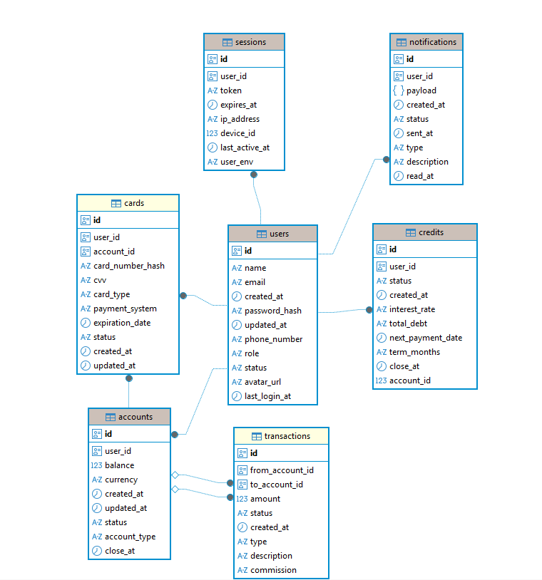
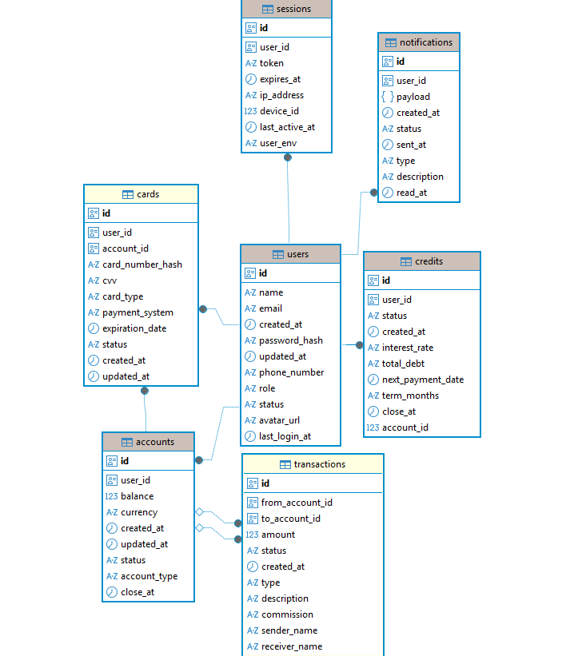

# Проектирование высоконагруженного аналога Альфа-банка

## Описание сервиса

**«Альфа-банк»** — крупнейший частный банк в России, занимающий четвёртое место по размеру активов. В 2025 году количество частных клиентов банка превышает 36 млн человек, количество клиентов малого и среднего бизнеса — 1,9 млн.

## Целевая аудитория

- Количество пользователей в месяц(**MAU**): 36млн [1](https://ru.wikipedia.org/wiki/%D0%90%D0%BB%D1%8C%D1%84%D0%B0-%D0%B1%D0%B0%D0%BD%D0%BA#:~:text=%D0%90%D0%BB%D1%8C%D1%84%D0%B0%2D%D0%B1%D0%B0%D0%BD%D0%BA%20%D0%B2%D1%85%D0%BE%D0%B4%D0%B8%D1%82,13%5D.).
- Количество пользователей в день(**DAU**): ~8-15млн [2](https://ru.wikipedia.org/wiki/%D0%90%D0%BB%D1%8C%D1%84%D0%B0-%D0%B1%D0%B0%D0%BD%D0%BA#:~:text=%D0%90%D0%BB%D1%8C%D1%84%D0%B0%2D%D0%B1%D0%B0%D0%BD%D0%BA%20%D0%B2%D1%85%D0%BE%D0%B4%D0%B8%D1%82,13%5D.).

- Географическое положение: Россия.

DAU была расчитана, как 20-40% пользователей.

## Ключевой функционал сервиса

- Авторизация и аутентификация пользователя

* Просмотр баланса и счетов

* Переводы между счетами и пользователями

* Открытие счетов

* Открытие кредитов

* Отслеживание баланса, проходящих операций в реальном времени

* История транзакций

## Ключевые продуктовые решения

- Все финансовые операции обрабатываются сервером с гарантией консистентности

- История операций хранится на сервере и доступна с любого устройства

- Баланс и последние операции кэшируются для быстрого отображения

- Переводы выполняются синхронно с подтверждением результата

- Реал-тайм обновления баланса

- Push уведомления

# Расчет нагрузки

## Продуктовые метрики

- Количество пользователей в месяц(**MAU**): 36млн [1](https://ru.wikipedia.org/wiki/%D0%90%D0%BB%D1%8C%D1%84%D0%B0-%D0%B1%D0%B0%D0%BD%D0%BA#:~:text=%D0%90%D0%BB%D1%8C%D1%84%D0%B0%2D%D0%B1%D0%B0%D0%BD%D0%BA%20%D0%B2%D1%85%D0%BE%D0%B4%D0%B8%D1%82,13%5D.).
- Количество пользователей в день(**DAU**): ~8-15млн [2](https://ru.wikipedia.org/wiki/%D0%90%D0%BB%D1%8C%D1%84%D0%B0-%D0%B1%D0%B0%D0%BD%D0%BA#:~:text=%D0%90%D0%BB%D1%8C%D1%84%D0%B0%2D%D0%B1%D0%B0%D0%BD%D0%BA%20%D0%B2%D1%85%D0%BE%D0%B4%D0%B8%D1%82,13%5D.).

### Среднее количество действий пользователя в день

| Тип данных                  | Значение |
| :-------------------------- | :------: |
| Проверка баланса и счетов   |   0.3    |
| Переводы                    |   0.3    |
| Открытие кредитов           |  ~0.003  |
| Просмотр истории транзакций |  ~0.15   |
| Push-уведомления            |  0.303   |

Обоснование:

- Переводы и проверка баланса - [Отчет ЦБ РФ](https://www.cbr.ru/analytics/nps/sbp/2_2025/#:~:text=%D0%A1%D1%80%D0%B5%D0%B4%D0%BD%D0%B5%D0%B5%20%D0%BA%D0%BE%D0%BB%D0%B8%D1%87%D0%B5%D1%81%D1%82%D0%B2%D0%BE%20%D0%BE%D0%BF%D0%B5%D1%80%D0%B0%D1%86%D0%B8%D0%B9%20%D0%B2%20%D1%81%D1%83%D1%82%D0%BA%D0%B8,51%20%D0%BC%D0%BB%D0%BD%2C%20%D0%BC%D0%B0%D0%BA%D1%81%D0%B8%D0%BC%D0%B0%D0%BB%D1%8C%D0%BD%D0%BE%D0%B5%20%E2%80%93%2064%20%D0%BC%D0%BB%D0%BD&text=%D0%9A%D0%BE%D0%BB%D0%B8%D1%87%D0%B5%D1%81%D1%82%D0%B2%D0%BE%20%D0%BE%D0%BF%D0%B5%D1%80%D0%B0%D1%86%D0%B8%D0%B9%2C%20%D0%BC%D0%BB%D1%80%D0%B4%20%D0%B5%D0%B4.&text=%D0%9F%D0%BE%D0%BF%D1%83%D0%BB%D1%8F%D1%80%D0%BD%D0%BE%D1%81%D1%82%D1%8C%20%D0%A1%D0%91%D0%9F%20%D1%81%D1%80%D0%B5%D0%B4%D0%B8%20%D0%BF%D0%BE%D0%BB%D1%8C%D0%B7%D0%BE%D0%B2%D0%B0%D1%82%D0%B5%D0%BB%D0%B5%D0%B9%20%D0%BF%D1%80%D0%BE%D0%B4%D0%BE%D0%BB%D0%B6%D0%B0%D0%B5%D1%82,%D0%BE%D0%BF%D0%BB%D0%B0%D1%82%D0%B8%D0%BB%20%D1%87%D0%B5%D1%80%D0%B5%D0%B7%20%D0%A1%D0%91%D0%9F%2019%20%D0%BF%D0%BE%D0%BA%D1%83%D0%BF%D0%BE%D0%BA.&text=%D0%92%20II%20%D0%BA%D0%B2%D0%B0%D1%80%D1%82%D0%B0%D0%BB%D0%B5%202025%20%D0%B3%D0%BE%D0%B4%D0%B0%20%D0%B2%20%D0%A1%D0%91%D0%9F%20%D0%B1%D1%8B%D0%BB%D0%BE%20%D1%81%D0%BE%D0%B2%D0%B5%D1%80%D1%88%D0%B5%D0%BD%D0%BE%203,%D0%B8%201%2C7%20%D1%80%D0%B0%D0%B7%D0%B0%20%D1%81%D0%BE%D0%BE%D1%82%D0%B2%D0%B5%D1%82%D1%81%D1%82%D0%B2%D0%B5%D0%BD%D0%BD%D0%BE.)
- Кредиты - [Отчёт сбербанка](<https://www.sberbank.ru/ru/sberpress/all/article?newsID=0999be0c-3fd9-4eb6-86ec-2959a783321c&blockID=1303&regionID=77&lang=ru&type=NEWS#:~:text=%D0%9F%D0%BE%D1%87%D1%82%D0%B8%20%D1%87%D0%B5%D1%82%D0%B2%D0%B5%D1%80%D1%82%D1%8C%20%D1%80%D0%B5%D1%81%D0%BF%D0%BE%D0%BD%D0%B4%D0%B5%D0%BD%D1%82%D0%BE%D0%B2%20(24%2C3,%D1%80%D0%B0%D0%B7%20%D0%B2%20%D0%B3%D0%BE%D0%B4%20(27%25).>)
- Проверка истории транзакций - [Статья о том как часто стоит мониторить ваши средства](https://www.pnc.com/insights/personal-finance/spend/how-often-should-you-check-bank-account.html#:~:text=The%20frequency%20with%20which%20you,it%20multiple%20times%20a%20day.)

### Средний размер хранилища пользователя

Банки в России обязаны хранить основную информацию о клиентах, операциях и счетах не менее 5 лет после закрытия счёта или завершения обслуживания (по 115-ФЗ, www.26-2.ru, Consultant.ru). Кредитная история хранится 7 лет с даты последнего изменения Банки.ру. Сроки могут быть продлены при активных судебных или налоговых разбирательствах.

Так как нам надо хранить информацию 5 лет, то будем расчитывать этот период.

| Тип данных       | Среднее кол-во |   Размер | Общий объём |
| :--------------- | :------------: | -------: | ----------: |
| Транзакция       |     912 шт     | 0,225 кб |       205кб |
| Кредиты          |      5 шт      |      5кб |     27.5 кб |
| Счета            |      2 шт      |      2КБ |        6 кб |
| Профиль          |      1 шт      |     10КБ |       10 кб |
| Push-уведомления |     552 шт     |      4КБ |     2211 кб |
| Баланс/История   |     40 шт      |   0.2 КБ |        8 кб |
| Итого            |    1 512 шт    |        - |    2 467 кб |

- Транзакции ([размер одной транзакции](<https://21ideas.org/transaction-size/#:~:text=%D0%A2%D0%B8%D0%BF%D0%B8%D1%87%D0%BD%D1%8B%D0%B5%20%D1%80%D0%B0%D0%B7%D0%BC%D0%B5%D1%80%D1%8B%20%D1%82%D1%80%D0%B0%D0%BD%D0%B7%D0%B0%D0%BA%D1%86%D0%B8%D0%B9,%D0%B8%D0%BB%D0%B8%20374%20%D0%B1%D0%B0%D0%B9%D1%82%20(%D1%87%D0%B0%D1%89%D0%B5%20%D0%B2%D1%81%D0%B5%D0%B3%D0%BE)>)]): 0.5 в день \* 1825 дней = 912 транзакций. [Отчёт количества транзакций за квартал ЦБ РФ](https://www.cbr.ru/analytics/nps/sbp/4_2024/#:~:text=%D0%92%20IV%20%D0%BA%D0%B2%D0%B0%D1%80%D1%82%D0%B0%D0%BB%D0%B5%202024%20%D0%B3%D0%BE%D0%B4%D0%B0,45%20%D0%BC%D0%BB%D0%BD%2C%20%D0%BC%D0%B0%D0%BA%D1%81%D0%B8%D0%BC%D0%B0%D0%BB%D1%8C%D0%BD%D0%BE%D0%B5%20%E2%80%93%2060%20%D0%BC%D0%BB%D0%BD&text=%D0%9A%D0%BE%D0%BB%D0%B8%D1%87%D0%B5%D1%81%D1%82%D0%B2%D0%BE%20%D0%BE%D0%BF%D0%B5%D1%80%D0%B0%D1%86%D0%B8%D0%B9%2C%20%D0%BC%D0%BB%D1%80%D0%B4%20%D0%B5%D0%B4.&text=%D0%9F%D0%BE%D0%BF%D1%83%D0%BB%D1%8F%D1%80%D0%BD%D0%BE%D1%81%D1%82%D1%8C%20%D1%81%D0%B5%D1%80%D0%B2%D0%B8%D1%81%D0%BE%D0%B2%20%D0%A1%D0%91%D0%9F%20%D1%81%D1%80%D0%B5%D0%B4%D0%B8%20%D0%BF%D0%BE%D0%BB%D1%8C%D0%B7%D0%BE%D0%B2%D0%B0%D1%82%D0%B5%D0%BB%D0%B5%D0%B9,%D0%BE%D0%BF%D0%BB%D0%B0%D1%82%D0%B8%D0%BB%20%D1%87%D0%B5%D1%80%D0%B5%D0%B7%20%D0%A1%D0%91%D0%9F%2017%20%D0%BF%D0%BE%D0%BA%D1%83%D0%BF%D0%BE%D0%BA.&text=%D0%9A%D0%BE%D0%BB%D0%B8%D1%87%D0%B5%D1%81%D1%82%D0%B2%D0%BE%20%D0%B8%20%D1%81%D1%83%D0%BC%D0%BC%D0%B0%20%D1%81%D0%BE%D0%B2%D0%B5%D1%80%D1%88%D0%B5%D0%BD%D0%BD%D1%8B%D1%85%20%D1%87%D0%B5%D1%80%D0%B5%D0%B7,%D1%80%D1%83%D0%B1%D0%BB%D0%B5%D0%B9.)
- Кредиты: 0.003 в день \* 1825 дней = ~5.5 кредитов (включая заявки, отказы и закрытые договоры).
- Логи действий (Баланс + История): (0.3 + 0.15) = 0.45 логов в день. Храним 90 дней (TTL). 0.45 \* 90 = ~40 записей логов единовременно.
- Базовые сущности (Профиль, Счета): У каждого юзера есть 1 профиль и минимум 2 счета (чтобы было откуда делать переводы).
- Push-уведомления ([Размер пуша](https://inbriefcrm.ru/blog/44/#:~:text=2.%20%D0%9F%D1%80%D0%B5%D0%B4%D0%B5%D0%BB%20%D0%B7%D0%B0%D0%B3%D1%80%D1%83%D0%B7%D0%BA%D0%B8%0A%0A%D0%9F%D1%80%D0%B5%D0%B4%D0%B5%D0%BB%20%D1%80%D0%B0%D0%B7%D0%BC%D0%B5%D1%80%D0%B0%20%D1%81%D0%BE%D0%BE%D0%B1%D1%89%D0%B5%D0%BD%D0%B8%D1%8F%20%D0%B2%20GCM%20%D1%81%D0%BE%D1%81%D1%82%D0%B0%D0%B2%D0%BB%D1%8F%D0%B5%D1%82%204%20%D0%BA%D0%B8%D0%BB%D0%BE%D0%B1%D0%B0%D0%B9%D1%82%D0%B0.%20%D0%92%20iOS%208%20%D0%BC%D0%B0%D0%BA%D1%81%D0%B8%D0%BC%D0%B0%D0%BB%D1%8C%D0%BD%D1%8B%D0%B9%20%D1%80%D0%B0%D0%B7%D0%BC%D0%B5%D1%80%2C%20%D1%80%D0%B0%D0%B7%D1%80%D0%B5%D1%88%D0%B5%D0%BD%D0%BD%D1%8B%D0%B9%20%D0%B4%D0%BB%D1%8F%20%D0%BF%D0%BE%D0%BB%D0%B5%D0%B7%D0%BD%D0%BE%D0%B9%20%D0%BD%D0%B0%D0%B3%D1%80%D1%83%D0%B7%D0%BA%D0%B8%20%D1%83%D0%B2%D0%B5%D0%B4%D0%BE%D0%BC%D0%BB%D0%B5%D0%BD%D0%B8%D1%8F%2C%20%D1%82%D0%B0%D0%BA%D0%B6%D0%B5%204%20%D0%BA%D0%B8%D0%BB%D0%BE%D0%B1%D0%B0%D0%B9%D1%82%D0%B0%2C%20%D0%BF%D0%BE%D1%8D%D1%82%D0%BE%D0%BC%D1%83%20%D0%B5%D1%81%D0%BB%D0%B8%20%D0%BF%D0%BE%D0%BB%D1%8C%D0%B7%D0%BE%D0%B2%D0%B0%D1%82%D0%B5%D0%BB%D1%8C%20%D0%BD%D0%B0%D1%85%D0%BE%D0%B4%D0%B8%D1%82%D1%81%D1%8F%20%D0%BD%D0%B0%20%D1%81%D1%82%D0%B0%D1%80%D0%BE%D0%B9%20%D0%BF%D1%80%D0%BE%D1%88%D0%B8%D0%B2%D0%BA%D0%B5%2C%20%D0%BE%D0%BD%20%D0%BD%D0%B5%20%D1%81%D0%BC%D0%BE%D0%B6%D0%B5%D1%82%20%D0%BF%D0%BE%D0%BB%D1%83%D1%87%D0%B8%D1%82%D1%8C%20%D0%BA%D1%80%D0%B0%D1%81%D0%BE%D1%87%D0%BD%D0%BE%D0%B5%20%D1%81%D0%BE%D0%BE%D0%B1%D1%89%D0%B5%D0%BD%D0%B8%D0%B5.)): (0.3 + 0.003) \* 1825 дней = 552 уведомления

## Технические метрики

### Сетевой трафик

| Тип данных         |        Суточный объём (Тбайт/сут)         |     Средний трафик (Гбит/с) | Пиковый трафик (k=2) (Гбит/с) |
| :----------------- | :---------------------------------------: | --------------------------: | ----------------------------: |
| Проверка баланса   |   13 млн \* 0.3 \* 0.2 КБ = 0.00078 TB    |                    ~0.00007 |                      ~0.00014 |
| История транзакций |    13 млн \* 0.15 \* 50 КБ = 0.0975 TB    |                      ~0.009 |                        ~0.018 |
| Переводы           | 13 млн \* 0.3 кб \* 0,225 кб = 0.00088 TB |                    ~0.00008 |                      ~0.00016 |
| Открытие кредитов  |   13 млн \* 0.003 \* 5 кб = 0.000195 TB   |                    ~0.00002 |                      ~0.00004 |
| Push-уведомления   |   13 млн \* 0.3003 \* 4 кб = 0.0156 TB    |                     ~0.0015 |                        ~0.003 |
| Итого              |             0.115 TB / сутки              | 920 / 86400 ≈ 0.0106 Gbit/s |      0.011 × 2 = 0.022 Gbit/s |

Для определения пиковой нагрузки используется коэффициент суточной неравномерности k = 2.
Это означает, что в часы максимальной активности пользователей (утренние и вечерние часы) нагрузка на систему может быть примерно в два раза выше среднего значения.

### RPS по типам запросов

| Тип данных         | Общее кол-во запросов в сутки |      Средний RPS       | Пиковый RPS |
| :----------------- | :---------------------------: | :--------------------: | ----------: |
| Проверка баланса   |   13 млн \* 0.3 = 3 900 000   | 3 900 000 / 86400 ≈ 45 |         ~90 |
| История транзакций |  13 млн \* 0.15 = 1 950 000   | 1 950 000 / 86400 ≈ 23 |         ~46 |
| Переводы           |   13 млн \* 0.3 = 3 900 000   | 3 900 000 / 86400 ≈ 45 |         ~90 |
| Открытие кредитов  |   13 млн \* 0.003 = 39 000    | 39 000 / 86400 ≈ 0.45  |        ~0.9 |
| Push-уведомления   | 13 млн \* 0.3003 = 3 903 900  | 3 903 900 / 86400 ≈ 45 |         ~90 |
| Итого              |          13 692 900           |        ~158 RPS        |    ~316 RPS |

# Глобальная балансировка нагрузки

## Функциональное разбиение по доменам

У Альфа-банка довольно большой набор доменов, я выпишу самые важные и критичные для работы банка и для моего MVP.[Все домены Альфа-банка](https://bugbounty.bi.zone/companies/alfa-bank/main)

| Домен                    |       Назначение       |
| :----------------------- | :--------------------: |
| alfabank.ru              |     Основной домен     |
| private.auth.alfabank.ru | Сервисы аутентификации |
| ipoteka.alfabank.ru      |     Альфа‑Ипотека      |
| my.alfabank.ru           |      Альфа-Кредит      |

## Обоснования расположения ДЦ

| ДЦ  |    Расположение    | Процент от всех ДЦ |
| :-- | :----------------: | ------------------ |
| DC1 |       Москва       | 34%                |
| DC2 | Московская область | 33%                |
| DC3 |    Екатеринбург    | 33%                |

Для обеспечения минимальной отказоустойчивости, возможности проведения обновлений и обеспечения безопасной репликации данных, нам необходимо минимум 3 дата-центра.

Схема работы: **Active-Active-Active** это архитектура высокой доступности, в которой одновременно активны три или более узлов или серверов, распределяющих рабочую нагрузку.

## Anycast балансировка

Для банков критически важна защита от DDoS-атак и безопасность периметра. Поэтому перед нашими ДЦ ставится BGP Anycast сеть.
Как это работает:

- Все публичные IP-адреса сервисов Альфа-Банка анонсируются в глобальную сеть Интернет через протокол BGP с одинаковыми адресами из разных точек фильтрации.
- Запрос клиента маршрутизируется провайдером в топологически ближайший центр очистки трафика.
- В центре очистки отсекается паразитный трафик.
- Очищенный трафик по выделенным защищенным каналам отправляется к пограничным балансировщикам наших ДЦ.

# Локальная балансировка нагрузки

## Схема балансировки нагрузки

- **L4 - балансировка**:

| Параметр       | Описание                              |
| :------------- | :------------------------------------ |
| Решение        | F5 BIG-IP Local Traffic Manager       |
| Задача         | Рспределение трафика между портами L7 |
| Резервирование | Схема N\*2                            |

**Как запрос понимает на какой сервер ему надо идти?**

К нам приходит запрос не сервер, его перехватывает **VIP** адрес, который распределяет на какой сервер его надо будет отправить. Определяет на какой сервер отправить запрос он при помощи Local Traffic Manager и на основе различных алгоритмов (Round Robin, Least Connections, Fastest и др.). Ответ идёт к клиенту также через **VIP** адрес.

- **L7 - балансировка**:

| Параметр       | Описание                                                 |
| :------------- | :------------------------------------------------------- |
| Решение        | Программные балансировщики NGINX                         |
| Задачи         | SSL Termination, распределение запросов по микросервисам |
| Резервирование | Схема N+1                                                |

## Расчет количества балансировщиков

Расчет производится для одного дата-центра на основе пиковых показателей из Раздела глобальной балансировки:

- **Пиковый трафик**: 0.022 Гбит/с
- **Пиковая нагрузка**: 116 RPS

### 1. Расчёт L4:

- **Ограничитель** — пропускная способность сети.
- Предположим использование стандартных серверов с сетевым интерфейсом 10 Гбит/с.

  0.022 Гбит/с ÷ 10 Гбит/с = 0.0022

- Даже один сервер способен обработать нагрузку с большим запасом.
- **Минимально достаточное количество**: N = 1
  С учётом резервирования (N × 2): N = 2

**Итого**: **2 сервера**

### 2. Расчёт L7:

Учитываются два ограничителя:

- пропускная способность
- SSL Termination (CPS)

#### По пропускной способности

0.022 Гбит/с ÷ 10 Гбит/с = 0.0022

#### По SSL Termination

Пусть 50% запросов — новые TLS-соединения:

116 RPS × 0.5 ≈ 59 CPS

Согласно тестам NGINX: средний CPS сервера = 6676, а у нас всего 158 CPS, что значительно меньше чем 6000–10000, то можно прийти к вывожу что нам хватит и **1 сервера**. [NGNIX CPS](https://blog.nginx.org/blog/testing-the-performance-of-nginx-and-nginx-plus-web-servers#:~:text=32%20to%C2%A036.-,CPS%20for%20HTTPS%20Requests,-The%20table%20and)

## Итоговая конфигурация оборудования с учётом ограничителей

| Уровень | Количество | Тип резервирования |
| ------- | ---------- | ------------------ |
| L4      | 2          | N × 2              |
| L7      | 2          | N + 1              |

# Логическая схема БД

## Таблица с описанием таблиц

| Таблица       | Назначение       | Основные поля                                                                                                             | Размер строки | Кол-во строк | Размер таблицы | Запись (QPS)           | Чтение (QPS)                   |
| ------------- | ---------------- | ------------------------------------------------------------------------------------------------------------------------- | ------------- | ------------ | -------------- | ---------------------- | ------------------------------ |
| users         | Пользователи     | id(16), name(100), email(100), password_hash(250), phone_number(65), avatar_url(100), role(50), status(50),timestamps(48) | ~450 Б        | 36 млн       | ~16 ГБ         | Регистрация            | Чтение при заходе на странички |
| accounts      | Счета            | id(16), user_id, balance, currency, status, account_type                                                                  | ~150 Б        | 72 млн       | ~10 ГБ         | 3 900 000 / 86400 ≈ 45 | ~45                            |
| transactions  | Транзакции       | id(16), from_account_id, to_account_id, amount, status, type, commission                                                  | ~150 Б        | 33 млрд      | ~5 ТБ          | ~45                    | 1 950 000 / 86400 = 23         |
| credits       | Кредиты          | id(16), user_id, status, interest_rate, total_debt, term_months                                                           | ~120 Б        | 180 млн      | ~20 ГБ         | 39 000 / 86400 = 0.5   | ~1                             |
| notifications | Уведомления      | id(16), user_id, payload, status, type, read_at                                                                           | ~2 КБ         | 20 млрд      | ~80 ТБ         | ~45                    | ~45                            |
| sessions      | Сессии           | id(16), user_id, token, device_id, ip_address, expires_at                                                                 | ~200 Б        | 200 млн      | ~40 ГБ         | ~100                   | ~100                           |
| cards         | Банковские карты | id, user_id, account_id, card_number_hash, last4, card_type, payment_system, expiration_date, status                      | ~400 Б        | 72 млн       | ~28 ГБ         | ~45                    | ~45                            |

## Требования к консистентности

| **Strong consistency** | **Eventual consistency** |
| ---------------------- | ------------------------ |
| users                  | notifications            |
| transactions           | sessions                 |
| accounts               |                          |
| credits                |                          |
| cards                  |                          |

## Оссобенности нагрузки

Основной ключ шардинга: `user_id`, что помогает раномерно распределить данные пользователей.

# Физическая схема БД

## Выбор СУБД (потаблично)

| Таблица       | СУБД       | Схема шардирования | Резервирование     |
| ------------- | ---------- | ------------------ | ------------------ |
| users         | PostgreSQL | нет                | Master-Slave       |
| accounts      | PostgreSQL | нет                | Master-Slave       |
| transactions  | PostgreSQL | `from_account_id`  | Master-Slave       |
| credits       | PostgreSQL | нет                | Master-Slave       |
| notifications | Cassandra  | `user_id`          | Replication Factor |
| sessions      | Redis      | нет                | Master-Slave       |
| cards         | PostgreSQL | нет                | Master-Slave       |

## Обоснование конфигураций

- **PostgreSQL**: Выбран для критических данных (счета, балансы). Гарантирует ACID и строгую консистентность.
- **Cassandra**: Выбрана для уведомлений (80 ТБ данных). Позволяет линейно масштабировать запись и хранить огромные объемы с TTL.
- **Redis**: Используется для мгновенной проверки сессий .

---

## Индексы

| Таблица           | Поле                              | Тип индекса    | Размер индексов                                |
| ----------------- | --------------------------------- | -------------- | ---------------------------------------------- |
| **users**         | `id`                              | PRIMARY KEY    | (16 + 8) × 36M × 1.3 ≈ 24 × 36M × 1.3≈ 1.12 ГБ |
|                   | `email`                           | B-Tree         | 108 × 36M × 1.3 ≈ 5.05 ГБ                      |
|                   | `phone_number`                    | B-Tree         | 73 × 36M × 1.3 ≈ 3.4 ГБ                        |
| **accounts**      | `id`                              | PRIMARY KEY    | 24 × 72M × 1.3 ≈ 2.2 ГБ                        |
|                   | `user_id`                         | B-Tree(FK)     | 24 × 72M × 1.3 ≈ 2.2 ГБ                        |
| **transactions**  | `id`                              | PRIMARY KEY    | 24 × 33B × 1.3 ≈ 1 ТБ                          |
|                   | `(from_account, created_at DESC)` | Composite Key  | 32 × 33B × 1.3 ≈ 1.37 ТБ                       |
|                   | `(to_account, created_at DESC)  ` | Composite Key  | 32 × 33B × 1.3 ≈ 1.37 ТБ                       |
| **credits**       | `id`                              | PRIMARY KEY    | 5.6 ГБ                                         |
|                   | `user_id`                         | B-Tree(FK)     | 5.6 ГБ                                         |
| **notifications** | `id`                              | Clustering Key | 0 (включены Cassandra)                         |
|                   | `user_id`                         | Partition key  | 0 (включены Cassandra)                         |
|                   | `(user_id, created_at DESC) `     | Composite Key  | 0 (включены Cassandra)                         |
| **sessions**      | `id`                              | PRIMARY KEY    | 6.2 ГБ                                         |
|                   | `user_id`                         | B-Tree(FK)     | 6.2 ГБ                                         |
| **cards**         | `id`                              | PRIMARY KEY    | 24 × 72 млн × 1.3 ≈ 2.25 ГБ                    |
|                   | `user_id`                         | B-Tree         | 24 × 72 млн × 1.3 ≈ 2.25 ГБ                    |
|                   | `account_id`                      | B-Tree         | 24 × 72 млн × 1.3 ≈ 2.25 ГБ                    |
| **Итого**         |                                   |                | **~4 ТБ**                                      |

- размер ключа — размер поля (например id = 16 байт)
- pointer (указатель) ≈ 8 байт (в PostgreSQL)
- overhead ≈ 1.2–1.5 (B-Tree структура)

## Денормализация

1. **Имена в `transactions`**: При создании транзакции копируем туда `sender_name` и `receiver_name`. Это позволяет отображать историю операций без JOIN-ов с таблицей пользователей, что критично при распределенной БД.

## Балансировка запросов и мультиплексирование

- **PgBouncer**: не распределяет запросы, а управляет пулом подключений, значительно снижая нагрузку на сервер при большом количестве клиентов.
- **HAProxy**: TCP-балансировщик, часто используемый в связке с `PgBouncer` для высоконагруженных архитектур. Работает на уровне сети, отправляя запросы на доступные экземпляры `PostgreSQL`.

## Клиентские библиотеки / интеграции

- **Postgres**: `pgx` (Go) с поддержкой пула соединений `go-redis`.
- **Cassandra** - дабота с распределенной базой Cassandra реализована через `gocql`
- **Redis** - для хранилища сессий Redis используется `go-redis`

## Шардирование и Резервирование

- **Шардирование**
  - `from_account_id` как ключ в таблице `transactions`.
  - `user_id` как ключ в таблице `notifications`.
- **Резервирование**:
  - PostgreSQL: Кворумная синхронная репликация(Quorum Synchronous Replication). Метод обеспечения высокой надежности данных, при котором транзакция считается успешной только после подтверждения ее записи мастером и кворумом (большинством) реплик, а не всеми узлами. Даже при падении мастера данные гарантированно сохранены на одной из реплик.
  - Cassandra: процесс создания снимков данных (snapshots) и инкрементальных копий для защиты от потери информации.
  - Redis: Redis Sentinel для автоматического переключения на реплику failover.

## Схема резервного копирования

- **PostgreSQL**:
  - Непрерывное архивирование WAL-логов через **WAL-G** в S3.
  - Позволяет восстановить базу на любой момент времени.
  - Еженедельный Full Backup.
- **Cassandra**:
  - Ежедневные инкрементальные снапшоты с каждой ноды.
- **Проверка**:
  - Ежемесячное тестовое восстановление из бэкапов для подтверждения целостности данных.

# Использованные источники

- https://ru.wikipedia.org/wiki/%D0%90%D0%BB%D1%8C%D1%84%D0%B0-%D0%B1%D0%B0%D0%BD%D0%BA#:~:text=%D0%90%D0%BB%D1%8C%D1%84%D0%B0%2D%D0%B1%D0%B0%D0%BD%D0%BA%20%D0%B2%D1%85%D0%BE%D0%B4%D0%B8%D1%82,13%5D.
- https://bugbounty.bi.zone/companies/alfa-bank/main
- https://www.tadviser.ru/index.php/%D0%9F%D1%80%D0%BE%D0%B4%D1%83%D0%BA%D1%82:F5_BIG-IP_Local_Traffic_Manager_(LTM)
- https://alfabank.st/marketing/24/98/marketing/Data_centers_market_review_2025.pdf
- https://blog.nginx.org/blog/testing-the-performance-of-nginx-and-nginx-plus-web-servers#:~:text=32%20to%C2%A036.-,CPS%20for%20HTTPS%20Requests,-The%20table%20and
